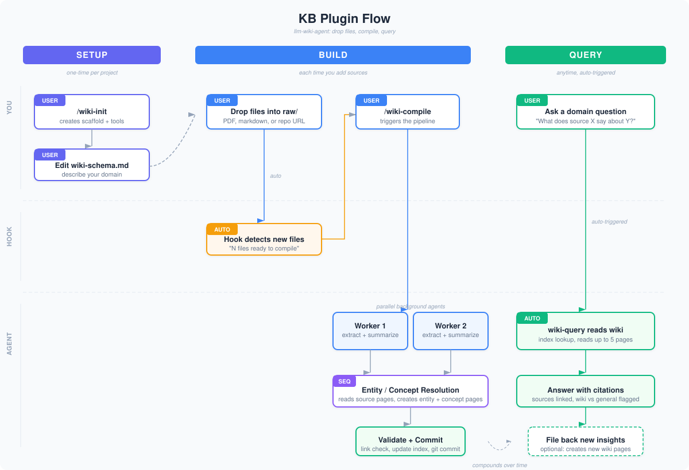

# LLM Wiki Agent

A Claude Code plugin that gives your agent persistent, structured memory. Drop PDFs, markdown files, or git repos into a folder — the agent extracts, compiles, and maintains a structured wiki. Ask domain questions and get answers grounded in your sources, with cross-references and citations.

## Install

**Prerequisites:** [Claude Code](https://docs.anthropic.com/en/docs/claude-code) installed and working.

```bash
# 1. Register the marketplace (one-time, no manual clone needed)
claude plugin marketplace add https://github.com/gal-Tab/agent_knowledgebase

# 2. Install the plugin
claude plugin install llm-wiki-agent

# 3. In any project, initialize a knowledge base
/wiki-init
```


**Optional dependencies** (checked by `/wiki-init`):
- `pymupdf4llm` — for PDF ingestion: `pip3 install --user pymupdf4llm`
- `repomix` — for repo ingestion: `npm install -g repomix` (npx fallback available)

## Usage

**Two human actions.** Everything else is automatic.

### 1. Drop files into `raw/`

```bash
cp ~/papers/interesting-paper.pdf raw/
cp ~/notes/meeting-notes.md raw/
```

### 2. Start a session and compile

```bash
claude
# Agent detects new files automatically on session start
# Say "compile" or use /wiki-compile to process them
```

### 3. Ask questions

Ask domain questions — the agent consults the wiki first, citing your sources:

> "What does the paper say about scaling laws?"
> "Compare the architectures described in these two papers"
> "What do we know about OpenAI's approach to training?"

The agent reads the wiki index, identifies relevant pages, and synthesizes answers with source citations.

## What You Get Per Project

After running `/wiki-init`, your project gets:

```
project/
├── raw/                       # Drop files here
│   ├── .manifest.json         # Pipeline state (auto-managed)
│   └── .extracted/            # Extracted markdown (auto-generated)
├── wiki/                      # Compiled wiki (auto-managed)
│   ├── index.md               # Content catalog
│   ├── sources/               # One summary per raw source
│   ├── entities/              # People, orgs, products, tools
│   ├── concepts/              # Ideas, frameworks, definitions
│   └── comparisons/           # Cross-source analysis
├── tools/
│   ├── extract-pdf.py         # PDF → markdown
│   └── extract-repo.sh        # Repo → markdown
├── wiki-schema.md             # Domain rules (customize this!)
└── HANDOFF.md                 # Session persistence
```

Each project has its own isolated knowledge base. The plugin provides the engine; your project owns the data.

## How Compilation Works

**Two-phase process:**

1. **Source page** — Agent reads extracted markdown, creates `wiki/sources/{slug}.md` with structured summary, and lists candidate entities/concepts
2. **Resolution** — For each candidate, agent checks the wiki index. Existing pages get updated. New pages are created if they meet the thresholds in `wiki-schema.md`. Index is updated, git commits track everything.

**Thresholds** (configurable in `wiki-schema.md`):
- **Entities:** Created if central to a source's thesis or mentioned in 2+ sources
- **Concepts:** Only domain-specific or novel concepts (not common knowledge)
- **Comparisons:** Only on explicit request or when sources clearly contradict

## Customizing for Your Domain

Edit `wiki-schema.md` after running `/wiki-init`. The most important part is the **Domain Description** — it tells the agent what counts as "common knowledge" vs worth a dedicated page.

Example for ML research:
```markdown
## Domain Description
Machine learning research. Covers model architectures, training techniques,
scaling laws, and benchmark results.
```

You can also customize entity types, page sections, creation thresholds, and compilation rules.

## Commands

| Command | What it does |
|---------|-------------|
| `/wiki-init` | Initialize a knowledge base in the current project |
| `/wiki-compile` | Compile new or updated files from raw/ into wiki pages |
| `/learn-capture` | Capture work-lessons (corrections, playbooks, insights, patterns) into the compound-learnings store |

The `wiki-query` skill auto-invokes when you ask domain questions — no command needed.

### Naming conventions

Commands, skills, and hooks follow one scheme so the surface stays predictable as it grows:

- **Two families, format `<family>-<verb>`** (kebab-case, lowercase, **verb** — not a noun or agent-role):
  - **`wiki-`** — build & query a wiki from external sources: `/wiki-init`, `/wiki-compile`, the `wiki-query` skill, the `wiki-status` hook.
  - **`learn-`** — capture & recall the agent's *own* compound lessons: `/learn-capture`, the `learn-recall` and `learn-research` skills, the `learn-surface` and `learn-capture` hooks. Matches the `lib/learning_*.py` modules and the `.compound/` store.
- A skill's directory name, its `name:` frontmatter, and its slug are identical.
- A hook's script filename matches the name passed in `hooks.json`; its test is `tests/test_<name_with_underscores>_hook.py`.
- `capture` is the write verb on both surfaces: the `/learn-capture` **command** is the deliberate manual save; the `learn-capture` **hook** auto-drafts at session end — same verb, two triggers.
- **Data IDs are out of scope.** This convention covers the *command/skill/hook surface* only. Persisted learning IDs keep their existing `kw-YYYY-MM-DD-<slug>` prefix on purpose — it's the on-disk identity format (filenames, index entries, the parser regex), and changing it would require migrating every existing store. Don't "finish the rename" on those.

## Compound Learnings

Beyond ingesting source documents, the plugin captures the agent's **own work-lessons**
so it improves over time — across every project it's installed in.

- **Types:** `correction` (a mistake not to repeat), `playbook` (a process that worked),
  `insight`, `pattern`.
- **Two tiers:** lessons land in the project store `.compound/` by default (committed,
  team-shareable). A lesson that genuinely generalizes can be promoted — with explicit
  approval — to the global store `~/.claude/compound-knowledge/` (override with
  `$COMPOUND_KNOWLEDGE_HOME`), which travels with you across repos.
- **Capture:** run `/learn-capture` (or approve auto-detected drafts at session end).
  Nothing is ever saved without approval; preferences/behaviors are redirected to MEMORY.
- **Token-frugal retrieval:** a compact `index.md` (one line per lesson) is grepped, never
  loaded whole; on a matching prompt, relevant lessons surface automatically as ≤3 headlines
  (corrections first), with bodies fetched on demand. Zero overhead when no store exists.
- **Recall skills:** `learn-recall` for quick interactive lookups ("have we hit this before?");
  `learn-research` for a thorough, isolated-budget sweep of past lessons while planning. Both
  are read-only and cite ids; `wiki-query` also consults the lessons index when answering
  domain questions.

See `templates/learning-schema.md` for the full contract.

## Supported Formats

| Format | Tool | Status |
|--------|------|--------|
| PDF | pymupdf4llm | Supported |
| Markdown / Text | passthrough | Supported |
| Git repos | repomix | Supported |

Adding a format = one extraction script + one line in the compile command.

## Architecture



```
Plugin (shared)          →  Project (per-project)
  hooks/wiki-status             raw/ + wiki/ + manifest
  commands/wiki-compile         wiki-schema.md
  skills/wiki-query             HANDOFF.md
  tools/extract-*             tools/ (copied by wiki-init)
```

The plugin fires hooks on every session start and user prompt. In projects without a KB (no `raw/` directory), the hook exits silently with zero overhead.

## Scaling

| Wiki Size | Strategy |
|-----------|----------|
| 0-100 pages | Flat `index.md` |
| 100-300 pages | Category sub-indexes |
| 300+ pages | grep-based search |

## Inspired By

- [Karpathy's LLM Knowledge Bases](https://gist.github.com/karpathy/442a6bf555914893e9891c11519de94f)
- [Cole Medin](https://github.com/cole-medin) — git-as-memory
- [CandleKeep](https://getcandlekeep.com) — auto-detection model

## Changelog

- **0.4.0** — Aligned the **command/skill/hook surface** into two families: `kb-*` → `wiki-*` and `kw-*` → `learn-*` (e.g. `/kw-compound` → `/learn-capture`, `kw-researcher` → `learn-research`). Breaking change for the old slash-command names; no aliases. Persisted learning IDs (`kw-YYYY-MM-DD-<slug>`) are unchanged by design — see **Naming conventions** above.

## License

MIT
