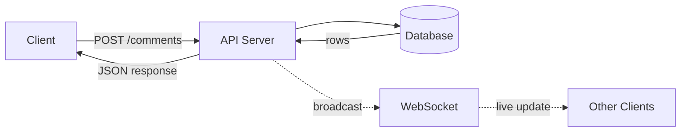
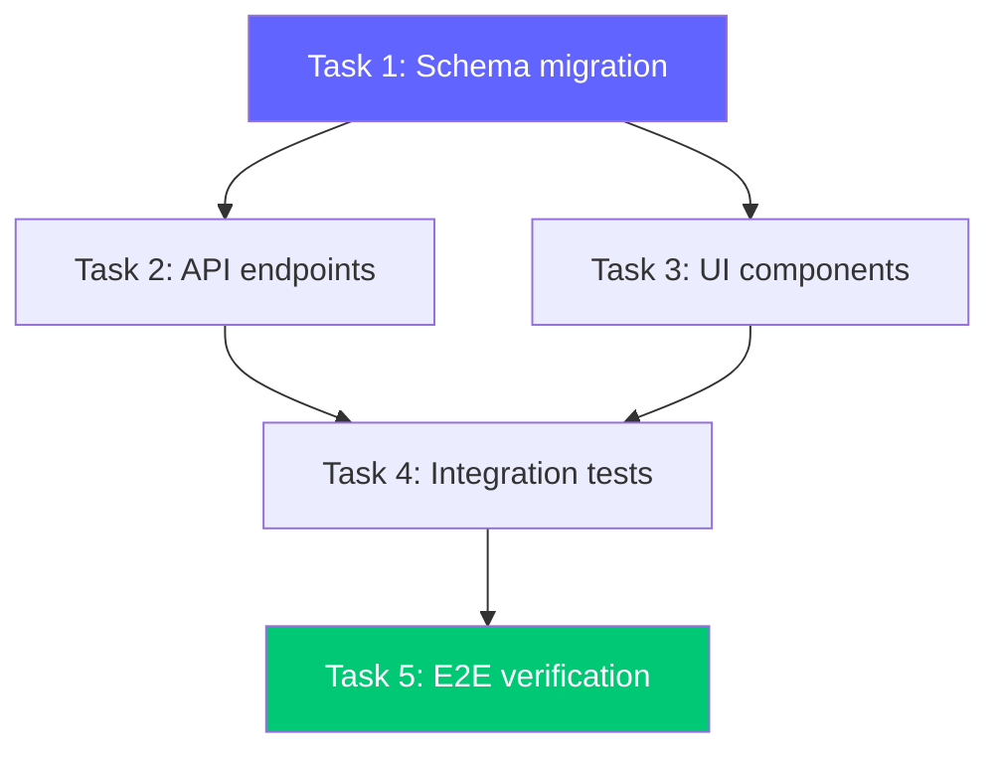
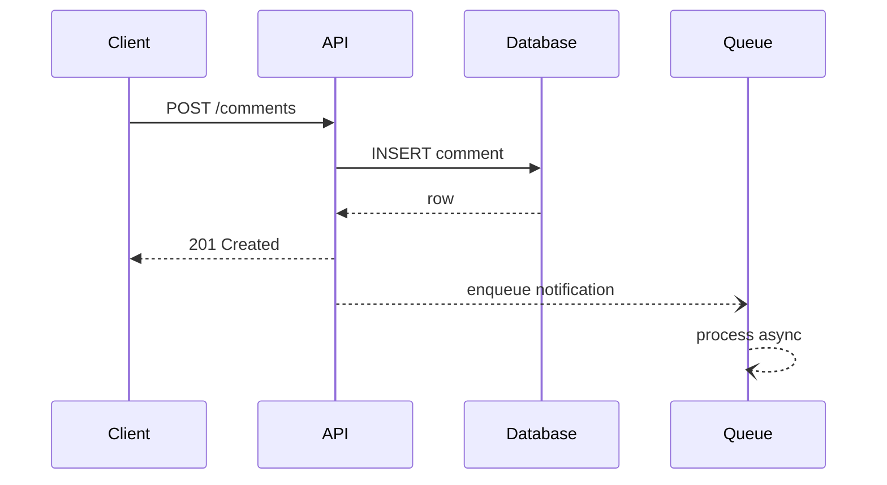
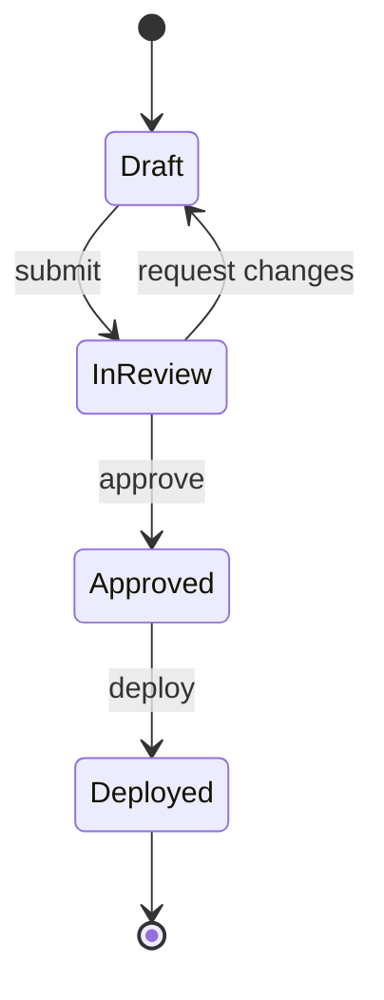
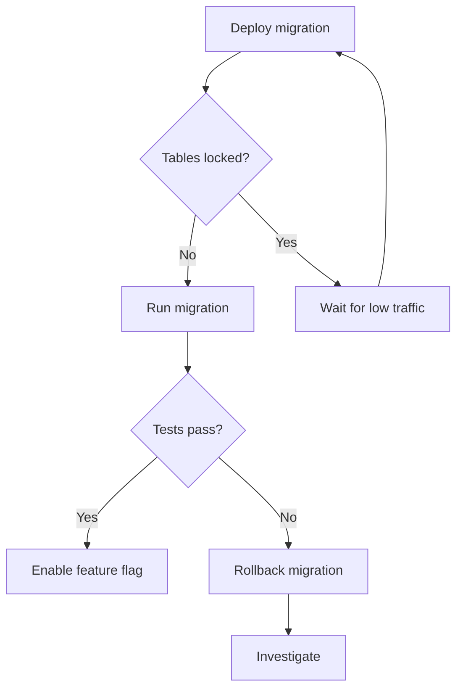

# Mermaid Diagram Patterns for Plans

Reference for generating Mermaid diagrams inside HTML plan files. Diagrams are rendered client-side via the Mermaid CDN — no build step.

## Setup

Include in `<head>`:
```html
<script src="https://cdn.jsdelivr.net/npm/mermaid@11/dist/mermaid.min.js"></script>
```

Initialize with monday.com theme in `<script>` at end of `<body>`:
```js
mermaid.initialize({
  startOnLoad: true,
  theme: 'dark',
  themeVariables: {
    primaryColor: '#6164ff',
    primaryTextColor: '#ffffff',
    primaryBorderColor: '#6164ff',
    lineColor: '#c3ced8',
    secondaryColor: '#232427',
    tertiaryColor: '#2D3035',
    fontFamily: 'Poppins, sans-serif',
    fontSize: '14px',
    nodeBorder: '#6164ff',
    mainBkg: '#232427',
    clusterBkg: '#2D3035',
    edgeLabelBackground: '#232427',
    actorBkg: '#6164ff',
    actorTextColor: '#ffffff',
    actorLineColor: '#c3ced8',
    signalColor: '#c3ced8',
    signalTextColor: '#ffffff',
    activationBkgColor: '#2D3035',
    sequenceNumberColor: '#ffffff'
  }
});
```

## Embedding

Wrap diagrams in a styled container:
```html
<div class="diagram-container">
  <div class="diagram-title">Data flow: comment creation</div>
  <pre class="mermaid">
    flowchart LR
      A[Client] -->|POST| B[API]
  </pre>
</div>
```

## Common Patterns for Plans

### 1. Data Flow (most common)

Use `flowchart LR` (left-to-right) for request/response flows:



Tips:
- Solid arrows `-->` for synchronous / request-response
- Dashed arrows `-.->` for async / fire-and-forget
- Use pipe syntax for edge labels: `-->|label|`
- Wrap node labels with special chars in quotes: `A["Node (with parens)"]`
- Keep to 6-10 nodes max — split into multiple diagrams if larger

### 2. Task Dependency Graph

Use `flowchart TD` (top-down) for showing which tasks block others:



Tips:
- Color the first task purple and the verification task green
- Use `style` directives for monday brand colors
- Show parallelizable tasks at the same vertical level

### 3. Sequence Diagram

Use for multi-service interactions, auth flows, API call chains:



Tips:
- `->>`  solid arrow with arrowhead (synchronous)
- `-->>` dashed arrow (response)
- `--)` async message (no response expected)
- Keep participants to 4-5 max
- Use short aliases: `participant C as Client`

### 4. State Diagram

Use for feature flag states, status machines, lifecycle flows:



### 5. Simple Flowchart with Decisions

Use for conditional logic, migration strategies, rollback plans:



## Style Guide

- **Node shapes**: `[rectangles]` for components, `[(cylinders)]` for databases, `{diamonds}` for decisions, `([rounded])` for start/end
- **Keep it small**: 5-10 nodes per diagram. If bigger, split into multiple diagrams with clear labels
- **Label edges**: Always label with the action or data being passed
- **Left-to-right for flows**, top-down for hierarchies/dependencies
- **Use monday colors** via style directives:
  - Purple `#6164ff` for primary/start nodes
  - Green `#00c875` for success/end nodes
  - Yellow `#ffcb00` for warning/decision nodes
  - Red `#ff3d57` for error/rollback nodes
  - Surface `#232427` for standard nodes

## When NOT to Use Diagrams

- Plan touches 1-2 files with no data flow → skip
- The flow is purely sequential with no branching → the task list itself is the diagram
- You'd be making a diagram just to have one → skip

Diagrams earn their place when they show relationships, parallelism, or data flow that would take 3+ paragraphs to describe in text.
